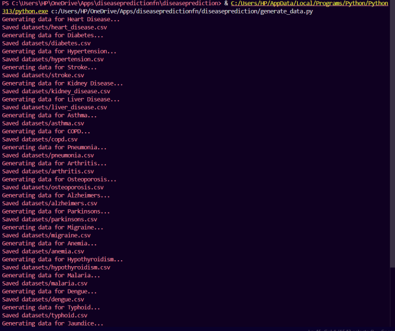
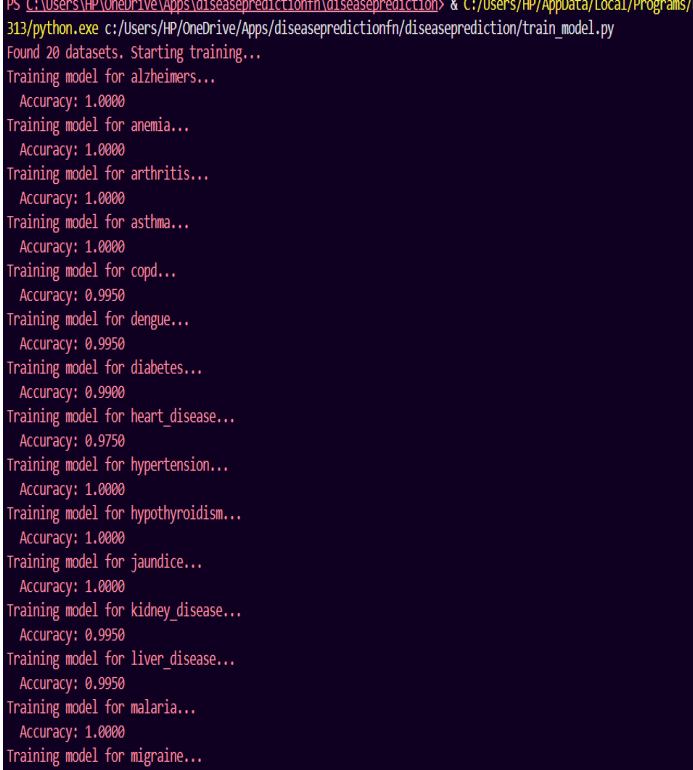
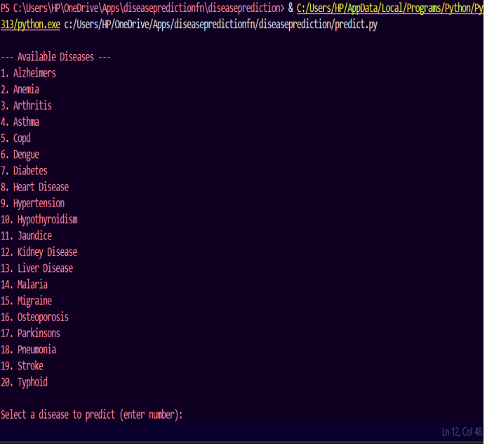
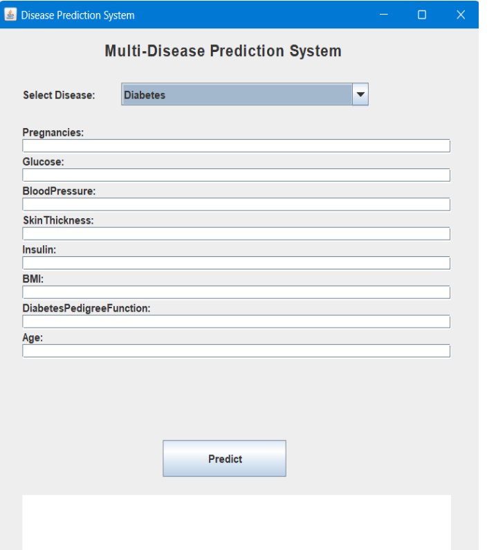

# Multi Disease Prediction System

## Overview

The Multi Disease Prediction System is a machine learning-based healthcare application designed to predict the likelihood of multiple diseases using patient medical data. The system integrates Python-based machine learning models, a Flask REST API, and a Java Swing graphical user interface for an end-to-end prediction workflow.

The application supports disease prediction for conditions such as Diabetes, Heart Disease, Liver Disease, Asthma, COPD, Arthritis, Anemia, Dengue, Alzheimer's, and more.

## Features

- Multi-disease prediction using dedicated ML models
- Data preprocessing and feature scaling
- Random Forest-based classification models
- REST API for prediction requests
- Java Swing GUI for user interaction
- Automated dataset generation and model training
- Real-time risk prediction with probability scores

## Tech Stack

### Backend
- Python
- Pandas
- NumPy
- Scikit-learn
- Flask
- Joblib

### Frontend
- Java Swing

### Database / Storage
- CSV Datasets
- Serialized ML Models (.pkl)

## System Architecture

1. Dataset Layer
   - Medical datasets containing disease-related features

2. Machine Learning Layer
   - Data preprocessing
   - Feature scaling using StandardScaler
   - Random Forest model training
   - Model persistence using Joblib

3. API Layer
   - Flask REST API
   - Receives prediction requests
   - Returns prediction results and probability scores

4. GUI Layer
   - Java Swing interface
   - Collects patient details
   - Displays disease risk predictions

## Datasets Used

### Diabetes Dataset (PIMA Indians Diabetes Dataset)
- Samples: 768
- Features: 8
- Target: Diabetes (0/1)

### Heart Disease Dataset
- Samples: 303
- Features: 14
- Target: Heart Disease Presence

### Liver Disease Dataset
- Samples: 583
- Features: 10
- Target: Liver Disease

Additional datasets were used for diseases such as:
- Asthma
- COPD
- Arthritis
- Anemia
- Dengue
- Alzheimer's Disease

## Data Preprocessing

- Missing value handling
- Mean imputation
- Outlier detection using IQR
- Winsorization
- Feature scaling using StandardScaler
- Exploratory Data Analysis (EDA)

## Machine Learning Model

Algorithm Used:
- Random Forest Classifier

Evaluation Metrics:
- Accuracy Score
- Prediction Probability

## Project Structure

Multi-Disease-Prediction-System/

├── datasets/

├── models/

├── generate_data.py

├── train_model.py

├── predict.py

├── api.py

├── DiseasePrediction.java

├── requirements.txt

└── README.md

## How to Run

### Install Dependencies

pip install -r requirements.txt

### Generate Datasets

python generate_data.py

### Train Models

python train_model.py

### Start Flask API

python api.py

### Run Java GUI

javac DiseasePrediction.java

java DiseasePrediction

## Advantages

- Supports multiple diseases
- Real-time prediction
- Easy to extend with new diseases
- User-friendly GUI
- Automated training pipeline

## Future Improvements

- Integration with real-world healthcare datasets
- Web-based dashboard using Flask/React
- Deep Learning models
- Explainable AI (XAI)
- Prediction history and analytics dashboard
  
## Application Interface

### Main Screen

### Input Form

### Prediction Result

## Author

Manish Mehta

## License

This project is developed for educational and learning purposes.
